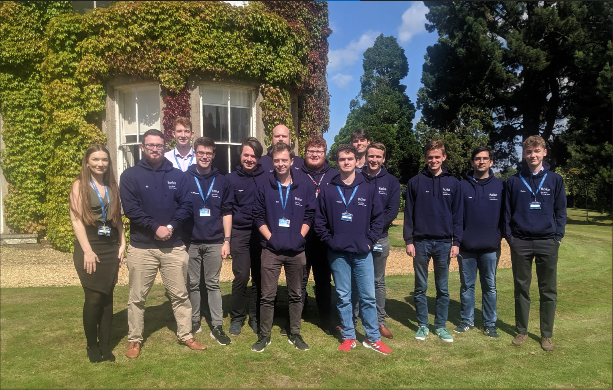

# Hello World

Welcome to my first blog post! 

I'll keep this introduction brief as I'm sure I'll rant on about my background and interests later on this page, so if you're looking for the __tl;dr__ here it is:

> I'm a Computer Science graduate from the University of Southampton who's interested in all things coding, rocket science and baking bread. I develop small software projects in my spare time and like to play around with machine learning where I can. 

Now the elevator pitch is out of the way, feel free to read on about my background and interests. If you're interested in how I made this website, I recommend you [check out this link](/home/eg/how-its-made).


> <sup>- Myself (left) and [local baking nerd](https://www.cakeandpositivitea.co.uk/) (right).</sup>

### Background

I'm a Computer Scientist from the [University of Southampton](https://www.ecs.soton.ac.uk/) who graduated in 2020 with First Class Honours. I took optional modules in computer vision, cyber security and machine learning. My dissertation investigated how machine learning models could be used to detect malicious websites based on their URL, host data and webpage content. I was able to produce random forest model with a recall score of 0.995 on webpage content derived features, but concluded a combination of all three sources of features would be the optimal approach. You can find a link to my investigation [here](/srv/www/URL-Analyser).

My first job was in 2014 as a Full-Stack Web Systems Manager for [NoteTones Music Productions](https://web.archive.org/web/20170710041203/http://notetones.com/) *(now dissolved)*. I was initially tasked with refactoring and updating the front and backend system written in ```HTML```, ```PHP```, and ```MySQL```, and quickly moved onto developing a fully-integrated client dashboard system for customers to interact with our staff alongside a live chat functionality made from scratch. Looking back I recognise the *many* mistakes a naive 15 year had made, which I would later learn to exploit and rectify within my cybersecurity module during university.

The first internship I had was in 2016 with the company [Wolfram Research](https://www.bloomberg.com/profile/company/0269405D:LN) (not quite Wolfram Alpha!) where I was responsible for debugging and fixing the Maths and Physics learning modules in their educational software, written in ```Mathematica``` and ```C```. This was quite the steep learning curve for me having to learn a new language, versioning control, testing methodology and quite possibly the hardest of all... __how to use an Apple Mac.__ I thoroughly enjoyed working alongside the core development team and learned so much in the span of six weeks.

My second internship was after my second year of university in 2019 at [Roke Manor Research](https://www.roke.co.uk/) in Romsey, Southampton. My group decided to investigate the current state of text analysis techniques in ```Python``` and host these on an internal website complete with corpus ingestion. The techniques we investigated included topic analysis using [TFIDF](https://en.wikipedia.org/wiki/Tf%E2%80%93idf), sentiment analysis using [DeepMoji](https://deepmoji.mit.edu/), and text summarising using [LSA](https://en.wikipedia.org/wiki/Latent_semantic_analysis). This project was presented in front of the company and the senior leadership team at the end of the internship, and this led to an offer of employment for when I finished my degree.



> <sup>- Roke Internship cohort (2019) outside Roke Manor.</sup>

After completing my degree in 2020 I joined as a Graduate Engineer at [Roke Manor Research](https://www.roke.co.uk) in the Data Science / Machine Learning profession. Since then I have been involved in several projects across the Defence and National Security industry's working in agile development teams. My innovative visualisation work for one client earned an instant award within the company to recognise my contributions. I have also volunteered for educational programs through the company including the summer placement students and Girls in Engineering day.

### My Interests

I'm a big fan of space exploration and the latest range of commerical rocket companies like [SpaceX](https://www.spacex.com/), [Rocket Lab](https://www.rocketlabusa.com/), and [Astra](https://astra.com/). I remember watching the first SpaceX booster landings, and in particular the [first Falcon Heavy flight](https://www.youtube.com/watch?v=wbSwFU6tY1c&ab_channel=SpaceX) featuring a double return to launch site landing. It is promising to see the industry moves towards reusable rockets as a means for reducing the cost to orbit and making space flight more akin to air travel. I hope to see these next generation launch vehicles land us on the moon, mars and beyond very soon!

One hobby I picked up during the coronavirus pandemic in 2020 while in a lockdown was sourdough! It's slightly different to using normal yeast from a packet since I began the process with only flour and water, slowly developing my own culture over time. I began baking loafs of bread early on, but have also attempted sourdough pancakes, crumpets, and *(my favourite)* pizzas. I have maintained the same sourdough starter (lovingly named *Dough-lin*) since then and continue to make my own bread on a weekly basis.


> <sup>- A sourdough pizza made from my starter.</sup>

If the scale and scope of this website wasn't evidence enough, I also enjoy coding in my spare time! Web development was one of my first passions given it's low barrier to entry, and led me to my other accomplishments like deploying a Tetris remake on the Google Play Store using [PhoneGap](https://blog.phonegap.com/). I enjoy making remakes of old games and have also remade Flappy Bird, Pokemon, and more recently a Minecraft clone which you can find in my [Voxel Engine repository](/srv/www/Voxel-Engine). I've also begun my own machine learning projects to gain a better understanding for my career, and bring to life some of my childhood dreams.

###  Contact Me

If you've been reading this and thought to yourself "he seems like a pretty neat guy" then feel free to get in touch with me! 

You can reach out to me by [Email](mailto:ejgorman@gmail.com) or find me on [Twitter](https://twitter.com/edgygorman), [LinkedIn](https://linkedin.com/in/edward-john-gorman) and of course [Github](https://github.com/edgorman). 