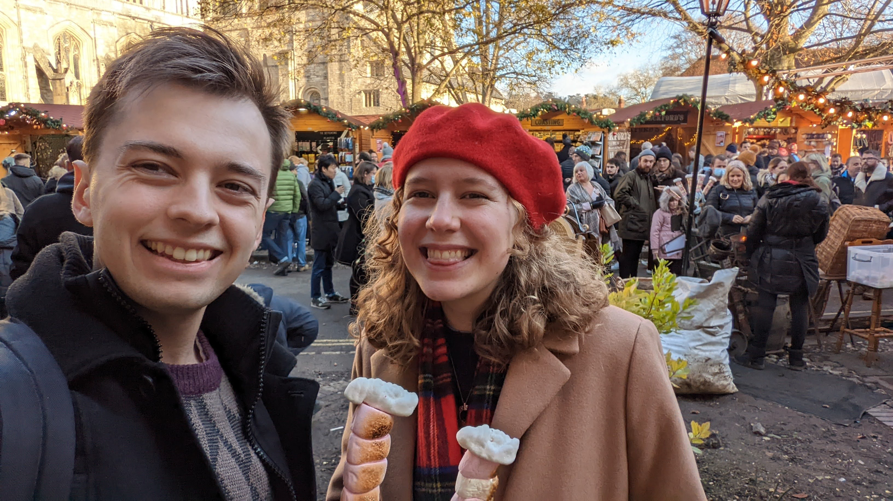

# Hello World

Welcome to my first blog post! 

I'll keep this introduction brief as I'm sure I'll rant on about my background and interests later on this page, so if you're looking for the __tl;dr__ here it is:

> "I'm a Computer Science graduate from the University of Southampton who's interested in coding, space and baking. I've got a history of recreating my favourite games from scratch in whatever language I'm using at the time. I regularly develop software in my spare time and like to incorporate machine learning/data science where I can". 

Now the elevator pitch is out of the way, feel free to read on about my background and interests. If you're interested in how I made this website, I recommend you [check out this link](/home/eg/how-its-made).

> - Myself (left) and [local baking nerd](https://www.cakeandpositivitea.co.uk/) (right).

### Background

I'm a Computer Scientist from the [University of Southampton](https://www.ecs.soton.ac.uk/) who graduated in 2020 with First Class Honours. My dissertation involved investigating whether machine learning models could be used to detect malicious websites based on their URL, server data and webpage content.

My first experience as a Software Developer was in 2014 as Full-Stack Web Systems Manager for [NoteTones Music Productions](https://web.archive.org/web/20170710041203/http://notetones.com/) *(now dissolved)*. This involved the complete development of the public facing website and client dashboard and communications.

The first internship I had was in 2016 with the company [Wolfram Research](https://www.bloomberg.com/profile/company/0269405D:LN) (not quite Wolfram Alpha!) where I was responsible for debugging and fixing the Maths and Physics learning modules in their educational software, written in Mathematica and C.

I had another internship during my degree in 2019 at [Roke Manor Research](https://www.roke.co.uk/) designing analytical software capable of understanding and summarising text conversations using statistical analysis, neural networks, and natural language processing techniques.

After completing my degree, I was offered a position at [Roke Manor Research](https://www.roke.co.uk) as a Data Scientist / Machine Learning engineer where I have had first-hand experience in projects across the Defence and National Security domains.

### My Interests

I'm a big fan of space exploration and the latest range of commerical rocket companies like SpaceX, Rocket Lab, and Astra. Reusable rockets are impressive and inpsiring feats, and I believe they're key to humanity's future among the stars.

One hobby I picked up during the first coronavirus lockdown in 2020 was sourdough. Since then I have maintained my own sourdough starter (lovingly named *Dough-lin*) and make my own bread on a weekly basis, as well as the occasional pizza and cookie.

> - A sourdough pizza made from my very own starter.

If the scale of this website wasn't evidence enough, I also enjoy programming in my spare time. I have successfully deployed a game on the Android app store, created a 3D rendering engine from scratch in Java, and competed in coding competitions including Advent of Code. 

###  Contact Me

If you've been reading this and thought to yourself "he seems like a pretty neat guy" then feel free to get in touch with me! 

You can reach out to me by [Email](mailto:ejgorman@gmail.com) or find me on [Twitter](https://twitter.com/edgygorman), [LinkedIn](https://linkedin.com/in/edward-john-gorman) and of course [Github](https://github.com/edgorman). 