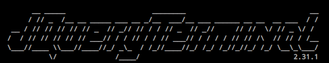

# Overview

The *traditional* side of the website is built upon the [Bootstrap Framework](https://getbootstrap.com/) and [JQuery Library](https://jquery.com/). The repository also makes use of the [Node Package Manager](https://www.npmjs.com/) to deploy a local http server for testing and development on your local system. 

The interesting stuff is a mix of bash scripts [located here](/sbin/) executing within a [Github action](https://github.com/features/actions) that generates ```JSON``` files representing the website [found here](/etc/). This enables you to navigate the website and see extra information like date of last commit, which a regular static website would be unable to do.

## History

My personal website has gone through many different styles and iterations over the years but for various reasons they never lasted long. My first website was hosted on [thenamrog.com](https://thenamrog.com) *(no longer accessible)* on which I posted HTML5 games I had made, as well as hosting a direct message chat and meme page accessible by my friends in school. I've also tried just a generic landing page for developers but I never had enough content to fill out the site/didn't want to do lots of manual work making content for it.

My first website soon faded after lack of use and due to a spike in website hosting costs, it would not last past 2017. Fast forward to 2021 and I've discovered that you could have a free website using [Github Page](https://pages.github.com/)! I decided to brush up on my old web dev skills and try again to make a professional website. To find out how this became the website you see today, read on!

## Terminal

Around the same time as my previous discovery I had found a cool [Terminal Library by JCubic](https://terminal.jcubic.pl/) that allowed you to create a command line display and facilitate user input/output functions. This naturally led to the idea of some sort of *Linux inspired* terminal where you could change directories, list files, display files and a few other special commands. 



> <sup>- The JQuery Terminal Banner (from [their website](https://terminal.jcubic.pl/)).</sup>

For a time this is all my website was, although I soon realised it would be quite unusable for non-technical individuals (despite adding a help message and text files giving help). At the same time I also realised I could write a [Github action](https://github.com/features/actions) to __automatically clone and host my public repositories on my website!__ This would solve the lack of content for the website, and for the least amount of manual work.

The Github repositories are cloned and updated automatically within the [srv/www/](/srv/www/) folder on each successful pull request using Github actions. Another shell scripts generates a ```JSON``` file containing the folder structure of the website, which can be found in the [etc](/etc) directory. Once complete, I had a fully functional terminal website but still no easy way for non-technical users to view my website, and so I designed a file explorer to solve this.

## File Explorer

This is where the scope of the project began to creep on a level where you wouldn't expect a human to do this to themselves. However, I had a vision and I knew the result would be a long-term solution that I could use and iterate on for years to come. 

Using similar methods to those used to create the terminal, I created several dynamic pages whose content would depend on the path/file the URL refers to. To achieve this, every page is rendered via the 404 redirect page since the idea is to host a directory view on a folder where no page exists to render it. Then it is simply a matter of using the ```JSON``` file to print the structure of the website. For creating directories I made use of the Bootstrap ```list-group``` class, as well as a side search bar for filtering which files are displayed.

Another element that required substantial testing and re-engineering was the navbar, as at first I wasn't sure how much a user would rely on it or whether the dynamic content displayed would handle their input completely. I settled for a minimal and intuitive design similar to traditional file explorers from Windows, including the ability to see files and folders when clicking on the forward slashes. I also added a metadata bar beneath the navbar to give extra information about the current page on display, as well as a share link.


> <sup>- An example of the navbar.</sup>

## File Rendering

It's probably no surprise but I used another library to help me display these markdown pages (markdown is just a lightweight method for adding formatting to simple text documents). I used [Marked](https://marked.js.org/) which was as simple as feeding in the contents of a .md page and appending the result to my content ```<div>``` in JQuery. I extended this enhanced display further by adding in anchor links when you hover over titles and subtitles, and also added a "Page Contents" view to quickly jump to these links within the page. 

I also wanted the ability to render files and was not satisfied with plain black and white output you see by visiting the actual URL (see the plain version of [this readme](README.md)). For code files I made use of [highlight.js](https://highlightjs.org/) for syntax highlighting of over 196 languages in 243 styles, and very simple integration. The navbar is also dynamic depending on the URL the user is currently visiting. 

## Final Thoughts

Given what I know now the website is in a *relatively* complete state, I'd have to admit it was probably not worth the tens of hours spent refactoring and developing this website. I wish I had known what I was building from the very beginning to save both time and effort spent on features that wouldn't see the light of day (at one point this included a way to edit/create files as a visitor). 

But I hope for those who manage to get to the end it gives you a starting point or advice on what to do and not do, when making a personal website!

Thanks for reading!

> <sup>- Ed </sup>