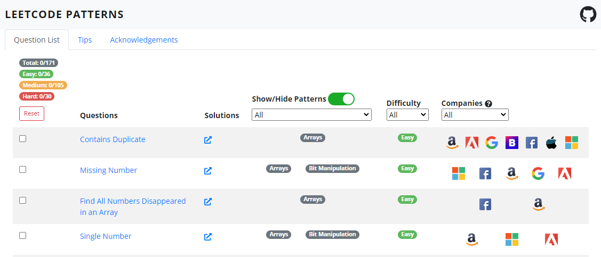

# Leetcode

I'll re-use a description I wrote for leetcode over in my [Leetcode repository](/srv/www/Leetcode/) which will also contain useful material for what I will discuss in this post:

> Leetcode is a common interview assessment process for demonstrating how able an applicant is at understanding, developing and explaining a solution to an unknown coding problem. Solutions are judged on their correctness, readability, and how optimal it is in terms of the space and time complexity of the program when executing.

A good website for practicing questions is [Leetcode.com](https://leetcode.com/problemset/all/), and the free tier is perfectly fine unless you really wan't to see company specific questions ([easily google-able I'm sure](https://lmgtfy.app/?q=list+of+leetcode+questions+for+google)).

## Approaching the Problems
As you might see when scanning reddit or other online social media websites, Leetcode problems are often regarded as one of the hardest steps when undergoing the interview process for a company, particularly for ~~FANG~~ [MAMAA](https://en.wikipedia.org/wiki/Big_Tech#FANG,_FAANG,_and_MAMAA) companies.

If you come at these problems without a background in Computer Science you might be confused how these solutions can be discovered in methodical ways - but ask any programmer with a degree and they'll mention you just need to learn some [Data Structures and Algorithms](https://www.programiz.com/dsa) and you'll be alright.

For those coming from bootcamps or other non-programming backgrounds it can be quite a difficult skill to learn, even after having undergone the studying. However, this is not the only way to approach the problem as I will show in the next section, and I encourage those who consider applying for technical positions to consider this advice:

__Don't__ try to solve these problems without getting a feel for __how__ to answer them correctly.

## Leetcode Patterns

Once you've started reading some Leetcode questions and had a feel for some difficult ones, you'll want to find an faster way at solving them. Thankfully there is an approach, called [Leetcode Patterns](https://seanprashad.com/leetcode-patterns/). This enables those training for technical interviews to repeatedly apply common patterns to leetcode questions, rather than attempting them in random order.

An important step of this process is not to simply attempt to solve all of a type of question at once, but rather to read and understand what each one is asking for and how the solution comes about finding the optimal solution. If the website you're using doesn't have the solution/give you access immediately a quick google should bring it to you. 

The benefits of this approach are that the repeated action of learning the same kinds of question enable us to afirm in our minds how to optimally solve this type of question in a shorter time. Once completed, you move onto the next batch of questions and on until all pattern types have been learned, possibly revisiting some older patterns as refreshers before moving on. 

Now this isn't to say that those without a programming background will suddenly be able to solve all leetcode problems (they should still read the theory of DS&A first), but you should find attacking the Leetcode problem set this way much simpler and faster than without.

## Benefits of Leetcode

For the interview process it is very apt method for demonstrating an individual is capable of understanding and explaining a given technical problem in a pragrmatic and methodical nature, gaining key insights into their reasoning and thought process. 

Most challenges can be solved within half an hour and supervised by the interviewer who has chosen the problem, allowing them to know what possible solutions the candidate might have beforehand as well as offer hints along the way if they need suggestions.

The problems are also (normally) abstracted away from any particular scenario meaning they do not require the candidate to have a background in something (other than to be able to program in the first place!), allowing this interview technique to be used across industries.

## Disadvantages of Leetcode

Despite it's ability to measure the technical ability of an individual, this will often have no direct correlation to the effectiveness of an engineer and this may be more several reasons:

* They had done exactly what this post describes and heavily researched how to answer Leetcode questions specifically, while they may be less effective at the typical problems a software engineer faces day to day.
* It does not demonstrate how well the individual work with others when solving problems as there is no collaboration element to the task, as it is likely they would not be solving these problems solely by themselves in the business (especially for junior positions).
* It is not representative of what that individual would be expected to do during their actual day to day job - if an engineer had to reinvent the wheel and implement a binary search tree algorithm everytime they wanted to look for a number in a set then no work would EVER be done on time.

## Conclusion

Overall I do sway on the side of being for Leetcode questions for the interview process, as I do believe they are an effective method for filtering the average candidates from the best candidates; however, I believe that the entire process has gone too far as even low technical companies imitate [MAMAA](https://en.wikipedia.org/wiki/Big_Tech#FANG,_FAANG,_and_MAMAA) in an attempt to find the *best* candidate when the actual best candidate just couldn't remember how to reverse a linked list array.

Thanks for reading!

> - Ed 